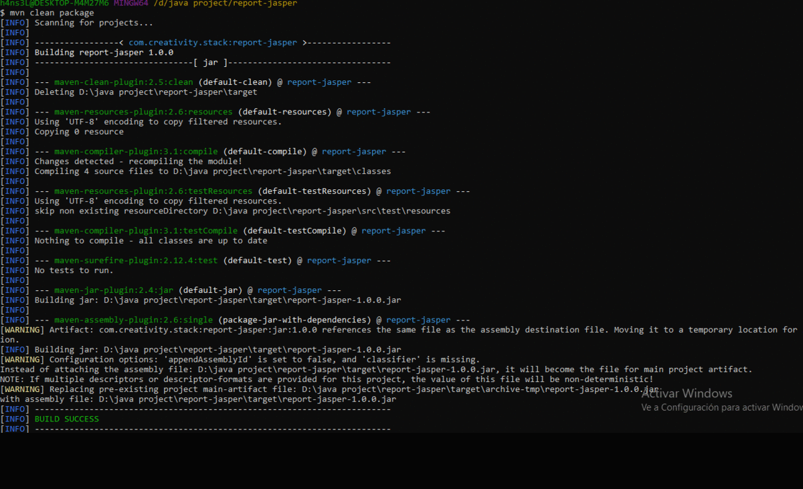

# Reporte en Java Application

[](https://travis-ci.org/joemccann/dillinger)

Demo CRUD con librerias de reporte Jasper-Report.



# Nuevas caracteristicas!

  - Esta es la última version preliminar.

### Instalación

Primero descargar el repositorio de [Demo-Java-Jasper-Report](https://github.com/Hans3L/Demo-Java-Jasper-Report.git).

Ir a la carpeta de Recursos  `src\main\resources` y ejecutar la query en el servidor de MySQL.
```sh
schema.sql
```
Compilar.
```sh
$ mvn clean package
```
Iniciar el ejecutable
```sh
$ java -jar target/report-jasper-1.0.0.jar
```
### Desarrollo

Como empezar a desarrollar?

Para continuar desarrollando la DEMO se recomienda las siguientes herramientas:

* IDE Eclipse 
* MySql 8.0
* Window Builder (Plugins nivel IDE)
* Jasper Report (Plugins nivel IDE)
* Java version 11 JDK
* Windows 7/8/10
* Maven 3.6.3
* Linux Ubuntu 16 LTS a +

License
----
MIT
